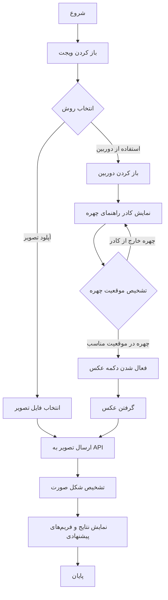

# ویجت پیشنهاد فریم عینک

این پروژه یک ویجت جاوااسکریپت برای تشخیص شکل صورت و پیشنهاد فریم عینک مناسب است. با افزودن یک اسکریپت ساده به هر وب‌سایتی، یک دکمه شناور ایجاد می‌شود که کاربران می‌توانند با کلیک روی آن، تصویر خود را آپلود کرده یا از دوربین استفاده کنند و فریم‌های عینک متناسب با شکل صورت خود را دریافت کنند.

## ویژگی‌ها

- دکمه شناور قابل تنظیم در سمت راست یا چپ صفحه
- قابلیت آپلود تصویر یا استفاده از دوربین
- کادر راهنمای چهره برای عکس‌برداری استاندارد
- تشخیص موقعیت چهره و غیرفعال‌سازی دکمه تا زمانی که چهره در موقعیت مناسب قرار گیرد
- ارسال تصویر به API تشخیص چهره
- نمایش شکل صورت تشخیص داده شده
- نمایش فریم‌های پیشنهادی مناسب با شکل صورت
- طراحی واکنش‌گرا و سازگار با موبایل
- پشتیبانی کامل از RTL و زبان فارسی

## فرآیند کار ویجت



## نصب و راه‌اندازی

### پیش‌نیازها

- Node.js (نسخه 14 یا بالاتر)
- npm یا yarn

### مراحل راه‌اندازی

1. کلون کردن پروژه:
   ```bash
   git clone https://github.com/yourusername/eyeglass-widget.git
   cd eyeglass-widget
   ```

2. نصب وابستگی‌ها:
   ```bash
   npm install face-api.js --save
   npm install
   ```

3. دانلود مدل‌های تشخیص چهره:
   - ایجاد پوشه `public/models` در ریشه پروژه
   - دانلود مدل‌های tiny_face_detector از [اینجا](https://github.com/justadudewhohacks/face-api.js/tree/master/weights)
   - قرار دادن فایل‌های مدل در پوشه `public/models`

4. شروع سرور توسعه:
   ```bash
   npm start
   ```
   این دستور یک سرور توسعه را در آدرس `http://localhost:3000` راه‌اندازی می‌کند.

5. برای ساخت نسخه تولید:
   ```bash
   npm run build
   ```
   فایل‌های خروجی در پوشه `dist` قرار می‌گیرند.

## نحوه استفاده در وب‌سایت شما

### روش 1: استفاده مستقیم از فایل جاوااسکریپت

1. فایل‌های خروجی را روی سرور خود آپلود کنید.

2. مدل‌های تشخیص چهره را در مسیر `/models` روی سرور خود آپلود کنید.

3. اسکریپت زیر را در صفحه HTML خود قرار دهید:

```html
<script src="http://your-server.com/eyeglass-widget.js"></script>
<script>
  new EyeglassWidget({
    apiEndpoint: 'https://your-api.com/api/v1/analyze',
    floatingButton: true,
    position: 'left', // یا 'right'
    buttonText: 'پیشنهاد فریم عینک',
    faceDetectionEnabled: true, // فعال/غیرفعال کردن تشخیص چهره
    faceDetectionModelsPath: '/models' // مسیر مدل‌های تشخیص چهره
  });
</script>
```

### روش 2: استفاده با ویژگی‌های data

```html
<script 
  src="http://your-server.com/eyeglass-widget.js"
  data-eyeglass-widget
  data-api-endpoint="https://your-api.com/api/v1/analyze"
  data-floating-button="true"
  data-position="left"
  data-button-text="پیشنهاد فریم عینک"
  data-face-detection-enabled="true"
  data-face-detection-models-path="/models">
</script>
```

### روش 3: استفاده در حالت توسعه

برای تست سریع در محیط توسعه، می‌توانید از آدرس `http://localhost:3000/eyeglass-widget.js` استفاده کنید:

```html
<script src="http://localhost:3000/eyeglass-widget.js"></script>
<script>
  new EyeglassWidget({
    apiEndpoint: 'https://your-api.com/api/v1/analyze',
    floatingButton: true,
    position: 'left',
    faceDetectionEnabled: true
  });
</script>
```

## تنظیمات قابل استفاده

| گزینه | توضیحات | پیش‌فرض |
|-------|---------|---------|
| `apiEndpoint` | آدرس API تشخیص چهره (الزامی) | - |
| `floatingButton` | آیا دکمه به صورت شناور نمایش داده شود | `true` |
| `position` | موقعیت دکمه شناور ('right' یا 'left') | `'left'` |
| `buttonText` | متن دکمه باز کردن ویجت | 'پیشنهاد فریم عینک' |
| `headerText` | متن سرتیتر مدال | 'پیشنهاد فریم عینک مناسب' |
| `uploadButtonText` | متن دکمه آپلود تصویر | 'آپلود تصویر' |
| `cameraButtonText` | متن دکمه استفاده از دوربین | 'استفاده از دوربین' |
| `viewProductText` | متن دکمه مشاهده محصول | 'مشاهده محصول' |
| `faceDetectionEnabled` | فعال‌سازی تشخیص موقعیت چهره | `true` |
| `faceDetectionModelsPath` | مسیر مدل‌های تشخیص چهره | '/models' |
| `faceGuideText` | متن راهنمای قرار دادن چهره در کادر | 'صورت خود را داخل کادر قرار دهید' |
| `facePositionMessage` | متن پیام وقتی چهره در موقعیت مناسب قرار گرفت | 'چهره شما در موقعیت مناسب قرار گرفته است' |
| `faceNotDetectedText` | متن پیام وقتی چهره‌ای تشخیص داده نشد | 'چهره‌ای تشخیص داده نشد' |

## ساختار API مورد نیاز

API باید از فرمت زیر پشتیبانی کند:

### درخواست:
- متد: POST
- URL: {apiEndpoint}
- Content-Type: multipart/form-data
- پارامترها:
  - `file`: فایل تصویر
  - `include_frames`: true

### پاسخ:
```json
{
  "success": true,
  "message": "تحلیل چهره با موفقیت انجام شد",
  "face_shape": "HEART",
  "confidence": 80,
  "description": "صورت قلبی دارای پیشانی پهن و فک باریک است.",
  "recommendation": "فریم‌های گرد و بیضی که در قسمت پایین پهن‌تر هستند، مناسب هستند.",
  "recommended_frame_types": [
    "گرد",
    "بیضی",
    "هاوایی",
    "پایین‌بدون‌فریم"
  ],
  "recommended_frames": [
    {
      "id": 1,
      "name": "فریم گرد برند X مدل Y",
      "permalink": "https://example.com/product/frame-1",
      "price": "900000",
      "regular_price": "1500000",
      "frame_type": "گرد",
      "images": [
        "https://example.com/wp-content/uploads/frames/frame_1.jpg"
      ],
      "match_score": 90
    }
  ]
}
```

## ویژگی کادر راهنما و تشخیص چهره

این ویجت دارای ویژگی کادر راهنما و تشخیص موقعیت چهره است که به کاربران کمک می‌کند تصاویر استانداردی از چهره خود تهیه کنند:

1. **کادر راهنمای چهره**: یک کادر بیضی شکل روی تصویر دوربین نمایش داده می‌شود که به کاربر نشان می‌دهد چهره خود را کجا قرار دهد.
2. **تشخیص موقعیت چهره**: به صورت زنده موقعیت چهره نسبت به کادر راهنما تشخیص داده می‌شود.
3. **فعال/غیرفعال کردن دکمه عکس‌برداری**: دکمه عکس‌برداری فقط زمانی فعال می‌شود که چهره در موقعیت مناسب قرار گرفته باشد.
4. **تغییر رنگ‌ها و پیام‌ها**: وقتی چهره در موقعیت مناسب قرار می‌گیرد، رنگ دکمه به سبز تغییر می‌کند و پیام راهنما نیز تغییر می‌کند.

این ویژگی‌ها باعث می‌شوند که:
- تصاویر با کیفیت بهتری گرفته شوند
- چهره در موقعیت مناسب قرار گیرد
- نتایج تشخیص شکل صورت دقیق‌تر باشند
- تجربه کاربری بهبود یابد

## عیب‌یابی

اگر با مشکلی مواجه شدید، موارد زیر را بررسی کنید:

1. آیا آدرس API صحیح است؟
2. آیا API به درستی پاسخ می‌دهد؟
3. آیا مرورگر شما اجازه دسترسی به دوربین را می‌دهد؟
4. آیا Cross-Origin Resource Sharing (CORS) در API شما فعال است؟
5. آیا مدل‌های تشخیص چهره به درستی در مسیر مشخص شده قرار دارند؟
6. آیا کتابخانه face-api.js به درستی نصب شده است؟
7. بررسی کنسول مرورگر برای پیدا کردن خطاهای احتمالی

## راهنمای انتشار

1. تنظیم آدرس API واقعی در کد نمونه
2. ساخت نسخه تولید با دستور `npm run build`
3. آپلود فایل‌های پوشه `dist` روی سرور CDN یا سرور وب شما
4. آپلود مدل‌های تشخیص چهره در مسیر `/models` روی سرور خود
5. اضافه کردن اسکریپت به وب‌سایت‌ها طبق راهنمای استفاده

## مجوز

این پروژه تحت مجوز MIT منتشر شده است.