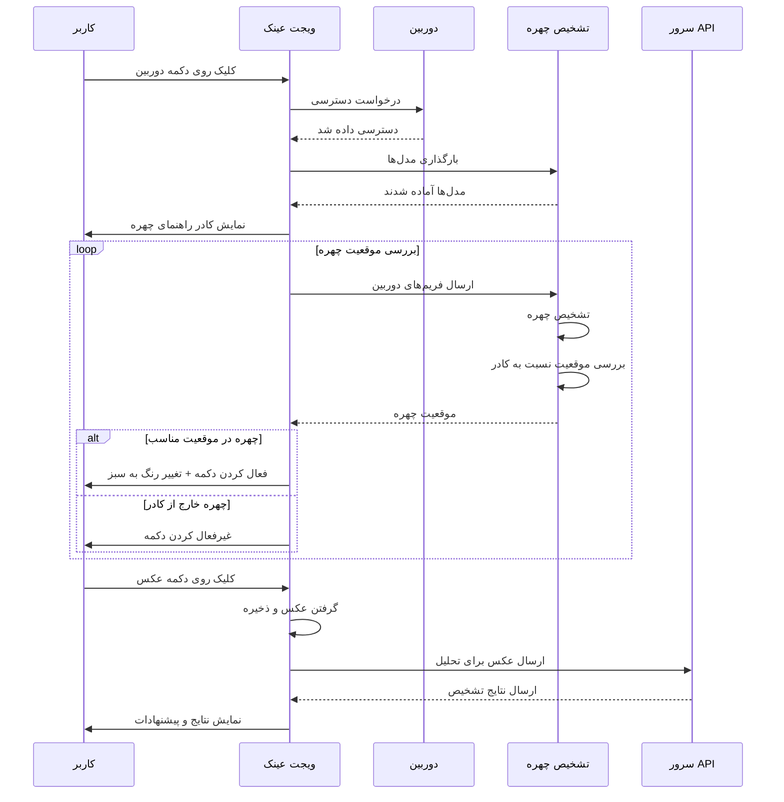

```mermaid
sequenceDiagram
    participant User as کاربر
    participant Widget as ویجت عینک
    participant Camera as دوربین
    participant FaceAPI as تشخیص چهره
    participant API as سرور API

    User->>Widget: کلیک روی دکمه دوربین
    Widget->>Camera: درخواست دسترسی
    Camera-->>Widget: دسترسی داده شد
    Widget->>FaceAPI: بارگذاری مدل‌ها
    FaceAPI-->>Widget: مدل‌ها آماده شدند
    Widget->>User: نمایش کادر راهنمای چهره
    
    loop بررسی موقعیت چهره
        Widget->>FaceAPI: ارسال فریم‌های دوربین
        FaceAPI->>FaceAPI: تشخیص چهره
        FaceAPI->>FaceAPI: بررسی موقعیت نسبت به کادر
        FaceAPI-->>Widget: موقعیت چهره
        
        alt چهره در موقعیت مناسب
            Widget->>User: فعال کردن دکمه + تغییر رنگ به سبز
        else چهره خارج از کادر
            Widget->>User: غیرفعال کردن دکمه
        end
    end
    
    User->>Widget: کلیک روی دکمه عکس
    Widget->>Widget: گرفتن عکس و ذخیره
    Widget->>API: ارسال عکس برای تحلیل
    API-->>Widget: ارسال نتایج تشخیص
    Widget->>User: نمایش نتایج و پیشنهادات
```