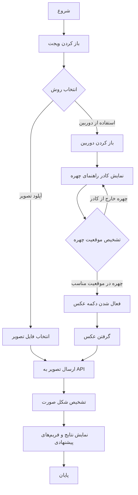

```mermaid
flowchart TD
    A[شروع] --> B[باز کردن ویجت]
    B --> C{انتخاب روش}
    C -->|آپلود تصویر| D[انتخاب فایل تصویر]
    C -->|استفاده از دوربین| E[باز کردن دوربین]
    E --> F[نمایش کادر راهنمای چهره]
    F --> G{تشخیص موقعیت چهره}
    G -->|چهره خارج از کادر| F
    G -->|چهره در موقعیت مناسب| H[فعال شدن دکمه عکس]
    H --> I[گرفتن عکس]
    D --> J[ارسال تصویر به API]
    I --> J
    J --> K[تشخیص شکل صورت]
    K --> L[نمایش نتایج و فریم‌های پیشنهادی]
    L --> M[پایان]
```